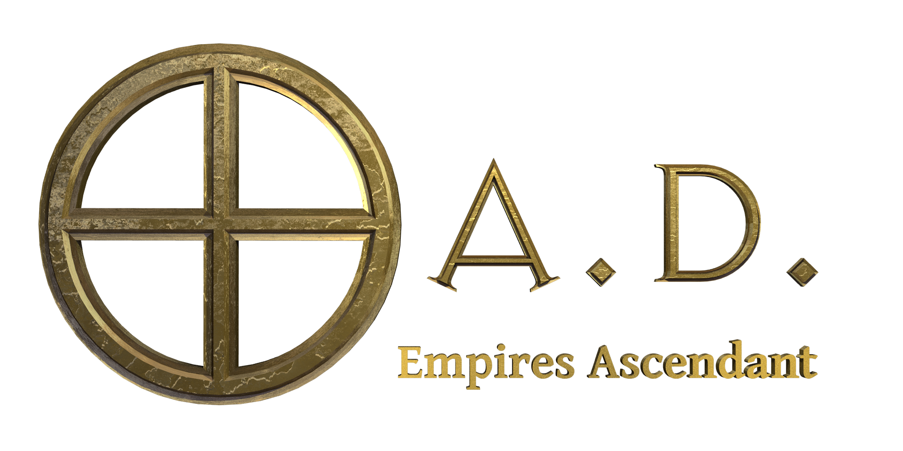

# 0 A.D.

<p align="center">
  
</p>

<p align="center">
  <strong>Unofficial project to run 0 A.D. in a container.</strong><br> 
  0 A.D. is a free, open-source, historical Real Time Strategy (RTS) game currently under development by Wildfire Games, a global group of volunteer game developers.
</p>

**Official project:** https://gitea.wildfiregames.com/0ad/0ad.

[](https://github.com/julienpoirou/0ad/actions/workflows/ci.yml)
[](https://github.com/julienpoirou/0ad/actions/workflows/codeql.yml)
[](https://github.com/julienpoirou/0ad/releases)
[](LICENSE)
[](https://www.conventionalcommits.org)
[](https://renovatebot.com)
[](https://hub.docker.com/r/julienpoirou/0ad)

## Game Setup

The image is published to both registries, with identical content:

* `docker.io/julienpoirou/0ad`: https://hub.docker.com/r/julienpoirou/0ad
* `ghcr.io/julienpoirou/0ad`: https://github.com/julienpoirou/0ad/pkgs/container/0ad

The game will be available at: http://localhost:8080/.

### Two variants

The commands below pull `latest`, which is **the game alone**, about 3 GiB.
Append `-mods` to any tag to get the same image plus the 89 mods listed in
[VENDORED.md](VENDORED.md), around 9 GiB, and worth it only if you want the
collection preinstalled. Everything else is byte-for-byte identical: the two
variants are built from the same Dockerfile stage, the mods are a single extra
layer on top.

| Tag | Contents | When to use it |
|---|---|---|
| `latest` / `latest-mods` | The newest build | Day-to-day. Moves under you when a new version ships. |
| `0.28.0` / `0.28.0-mods` | 0 A.D. 0.28.0 | Pin to a game version. |
| `0.28` / `0.28-mods` | Latest patch of 0.28 | Follow fixes without changing game version. |
| `0.28.0-20260906-1042` / `0.28.0-mods-20260906-1042` | One single build | Immutable on Docker Hub: never overwritten. |

Tags follow the game, not this repository: a Release is cut here only when
Wildfire Games publishes a new version of 0 A.D. Between two game versions the
image is still rebuilt, weekly, so that base-image security fixes reach you,
and whenever a mod is updated. Those rebuilds **move every tag above except
the timestamped one**, version tags included: `0.28.0` names the game version,
not one build of it.

The timestamped tag is the exception: one build, pushed once, never
overwritten. It is the tag to pin in a compose file you want to stay put.
The digest published in the `references.txt` asset of each
[Release](https://github.com/julienpoirou/0ad/releases) gives the same
guarantee, enforced by content addressing rather than by policy:

```bash
docker run ghcr.io/julienpoirou/0ad@sha256:<digest>
```

**Windows (WSL):**

```powershell
docker run -d --name 0ad --restart unless-stopped `
  --shm-size=2g `
  -p 127.0.0.1:8080:3000 `
  -p 20595:20595/udp `
  -v ${PWD}\profil\config:/config/.config/0ad/config `
  -v ${PWD}\profil\saves:/config/.local/share/0ad/saves `
  -v ${PWD}\profil\replays:/config/.local/share/0ad/replays `
  -v ${PWD}\profil\screenshots:/config/.local/share/0ad/screenshots `
  --gpus all `
  -v /usr/lib/wsl:/usr/lib/wsl:ro `
  --device /dev/dxg `
  julienpoirou/0ad:latest
```

**Linux:**

```bash
docker run -d --name 0ad --restart unless-stopped \
  --shm-size=2g \
  -p 127.0.0.1:8080:3000 \
  -p 20595:20595/udp \
  -v "$(pwd)/profil/config:/config/.config/0ad/config" \
  -v "$(pwd)/profil/saves:/config/.local/share/0ad/saves" \
  -v "$(pwd)/profil/replays:/config/.local/share/0ad/replays" \
  -v "$(pwd)/profil/screenshots:/config/.local/share/0ad/screenshots" \
  --gpus all \
  julienpoirou/0ad:latest
```

> For an AMD or Intel card, replace the `--gpus all` line with `--device /dev/dri`.

The launcher writes the selected renderer to `/config/0ad-launcher.log`. Read this file if the game falls back to the CPU or the screen stays black.

The 0 A.D. window opens fullscreen and follows the browser tab as it is resized. 0 A.D.'s own telemetry (the *UserReport* feedback system) is disabled by default and its main-menu prompt is hidden.

### Parameters

The container is configured entirely through `docker run` arguments.

| Parameter | Function |
|---|---|
| `-p 127.0.0.1:8080:3000` | The game, in a browser tab, over HTTP. Keep the `127.0.0.1:` prefix unless you mean to let the rest of the network play on your machine. |
| `-p 3001` | The same interface over HTTPS, with the base image's self-signed certificate. Not published by the commands above. |
| `-p 20595:20595/udp` | 0 A.D.'s multiplayer port. Needed only to **host** a game. Joining one does not require it. |
| `--shm-size=2g` | Shared memory for the game and stream compositor. |
| `-v <host>:/config/.config/0ad/config` | Game settings. Survives `docker rm` and image updates. |
| `-v <host>:/config/.local/share/0ad/saves` | Saved games. |
| `-v <host>:/config/.local/share/0ad/replays` | Replays. |
| `-v <host>:/config/.local/share/0ad/screenshots` | Screenshots. |
| `-v <host>:/config/.local/share/0ad/mods` | Optional. Your own mods, alongside those shipped by the `-mods` variant, see [VENDORED.md](VENDORED.md). A mod dropped here as a *directory* is installed on the next restart. An archive first needs `scripts/normalize-mods-0ad`. |
| `--gpus all` | NVIDIA card. Requires the NVIDIA Container Toolkit on the host. |
| `--device /dev/dri` | AMD or Intel card, on a native Linux host. Selkies automatically uses it for rendering and encoding. |
| `--device /dev/dxg` and `-v /usr/lib/wsl:/usr/lib/wsl:ro` | GPU under WSL. Both are required: without the bind mount, Mesa's `d3d12` driver has no `libd3d12core.so` and the game falls back to the CPU. |

### Environment variables

Selkies uses Wayland and automatically configures a mounted DRI GPU for rendering and video encoding. Every variable below has a working default.

| Variable | Default | Function |
|---|---|---|
| `PIXELFLUX_WAYLAND` | `true` | Enables the Wayland stream pipeline. |
| `AUTO_GPU` | `true` | Automatically selects the first mounted DRI GPU for rendering and encoding. |
| `DRINODE` | unset | Explicit DRI render node, for example `/dev/dri/renderD128`. |
| `DRI_NODE` | unset | Explicit DRI encoder node. Use the same node as `DRINODE` for zero-copy streaming. |
| `ZEROAD_GPU` | `auto` | Which adapter Mesa's `d3d12` driver should pick. `auto` asks the NVIDIA toolkit for the card's name, `default` leaves the choice to Mesa, any other value is taken as a card name. |
| `ZEROAD_RENDERER` | `auto` | Forces a renderer instead of probing: `d3d12` (WSL), `software` (llvmpipe, CPU only). |
| `TITLE` | `0ad` | Name shown as the browser tab title and the PWA name. |

See the [Selkies configuration reference](https://docs.linuxserver.io/selkies/user-guide/configuration/) for stream and UI options.
